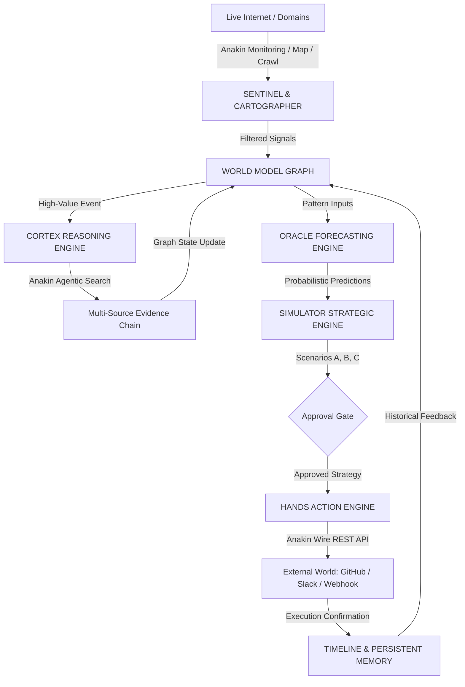

# WEBODY — The Living Operating System for the Internet

> **"The web changes every second. WEBODY remembers, understands, predicts, and acts."**
> 
> **Hackathon:** Anakin Forge — Build AI Agents That Read, Reason, and Act  
> **Participant:** Pochiraju Kailash Ram Markandeya Sharma  
> **Team:** kailashsharma  

---

## 1. Problem
Modern enterprises and competitive intelligence teams suffer from a fatal disconnect between web surveillance and action. Existing intelligence tools are either:
1. **Passive scraping scripts / RSS aggregators:** Drowning executives in low-value noise, minor DOM changes, and tracking cookie updates without context.
2. **Disconnected chatbots:** Simple single-agent LLMs that have no persistent spatial understanding of market topology, no memory of historical facts, and zero authority to execute countermeasures.

When a competitor slashes enterprise pricing by 22% or stealthily bundles compliance tooling, traditional tools merely send an alert email hours or days late. By the time leadership schedules an alignment meeting, competitive deals have already been lost.

---

## 2. Solution: WEBODY
**WEBODY is NOT a chatbot and NOT a single AI agent.**  
It is an autonomous, persistent web intelligence ecosystem that constructs a living digital world model around a business, product, market, or competitor set.

WEBODY continuously executes the closed autonomous loop:
```
OBSERVE → UNDERSTAND → PREDICT → SIMULATE → ACT → LEARN
```

Instead of asking you what to do, WEBODY:
1. **Observes** the live internet via Anakin Website Monitoring and Sentinel.
2. **Understands** the strategic gravity via Cortex and Anakin Agentic Search, linking evidence directly to the World Model graph.
3. **Predicts** what will happen next (with explicit probability bounds and uncertainty visualization) via Oracle.
4. **Simulates** realistic response pathways (scoring benefit, risk, and complexity) via Simulator.
5. **Acts** externally via Anakin Wire to create counter-measures (e.g., dispatching priority GitHub strategic initiatives).
6. **Learns** by writing the outcome back into the persistent temporal world model.

---

## 3. Why It Is Different
| Feature | Traditional Scrapers / Dashboards | Generic Chatbots | WEBODY (Living OS) |
| :--- | :--- | :--- | :--- |
| **World Representation** | Flat tables / raw text diffs | Ephemeral context window | Persistent temporal graph (nodes, relationships, history) |
| **Noise Handling** | Alert storm on every DOM change | None | Algorithmic suppression of cookie banners & minor noise |
| **Reasoning Engine** | None | Ad-hoc unverified answers | Multi-source verifiable evidence chains (never fabricates URLs) |
| **Forecasting** | Static charts | Guesswork without bounds | Oracle probabilistic predictions with uncertainty bounds |
| **Strategic Simulation** | None | Open-ended conversation | Comparative scenario matrix (Benefit, Risk, Complexity) |
| **Action Execution** | Read-only | Cannot trigger real workflows | Direct execution via Anakin Wire (5-phase confirmed lifecycle) |
| **Reliability** | Breaks on site changes | Hallucinates actions | Dual Live / Demo Deterministic Engine with secret isolation |

---

## 4. Architecture
WEBODY is engineered as a decoupled, production-grade microservices architecture:



### Backend Architecture (`backend/`)
- **Framework:** FastAPI (Python 3.11+) with asynchronous execution (`async`/`await`).
- **Database:** SQLAlchemy 2.0 Async ORM with SQLite for development and PostgreSQL (`asyncpg`) for production.
- **Cache & Message Broker:** Redis integration for job queuing and real-time state caching.
- **Observability:** Structured audit logging across every state transition:
  `timestamp`, `entity`, `workflow_id`, `duration_ms`, `status`.

### Frontend Architecture (`frontend/`)
- **Framework:** Next.js 14+ (App Router), React 18, TypeScript.
- **Styling:** Tailwind CSS with custom futuristic HUD tokens (`#06080F` background, cyan/violet/amber glowing accents, glassmorphic surfaces).
- **Icons & Motion:** Lucide React icons and Framer Motion micro-animations.

---

## 5. Official Anakin Integration
Anakin is a first-class infrastructure dependency. All Anakin operations are abstracted through `backend/services/anakin_client.py`, which strictly protects `ANAKIN_API_KEY`, enforces exponential backoff, rate limiting (HTTP 429), timeouts, and never claims an external action succeeded unless confirmed by API.

### Anakin Capabilities Used
1. **MAP (`/v1/map`)**: Discovers full URL topological structure of target domains.
2. **CRAWL (`/v1/crawl`)**: Obtains deep multi-page content with configurable depth and concurrency.
3. **URL SCRAPER (`/v1/scrape`)**: Extracts structured markdown and clean text while executing client-side JavaScript.
4. **SEARCH API (`/v1/search`)**: Real-time web search with source citations and verified snippets.
5. **AGENTIC SEARCH (`/v1/agentic-search`)**: Multi-step deep research agent that formulates sub-queries, navigates independent sources, and synthesizes verifiable evidence.
6. **WEBSITE MONITORING (`/v1/monitors`)**: Continuous surveillance of watch targets to detect price changes, documentation diffs, and hiring spikes.
7. **AI VISIBILITY (`/v1/ai-visibility/analyze`)**: Analyzes external LLM responses to track brand citations, competitor mentions, and sentiment associations.
8. **WIRE (`/v1/wire/task`)**: Executes validated external actions (such as creating GitHub strategy issues and notifying teams) with asynchronous polling.

---

## 6. Core Product Modules

### 1. SENTINEL — Observation Engine
- Continuously monitors targets: companies, competitors, products, pricing pages, docs, github repos, regulatory portals, status pages.
- Normalizes all external changes into structured Sentinel signals:
  ```json
  {
    "id": "sig-001",
    "entity": "Competitor X",
    "source": "competitorx.ai/pricing",
    "timestamp": "2026-09-10T09:42:00Z",
    "event_type": "price_changes",
    "title": "Competitor X enterprise tier reduced by 22%",
    "importance": 96,
    "severity": "critical",
    "actionability": "high"
  }
  ```
- **Noise Suppression:** Suppresses low-value noise (cookie banners, tracking pixels, analytics pings) via regex heuristics and deduplication windows.

### 2. CARTOGRAPHER — Web Mapping Engine
- Accepts any domain (e.g. `competitorx.ai`) and calls Anakin Map.
- Semantically classifies every discovered URL into 14 categories:
  `PRODUCT`, `PRICING`, `TECHNOLOGY`, `DOCUMENTATION`, `COMPANY`, `CAREERS`, `SECURITY`, `BLOG`, `PRESS`, `CUSTOMERS`, `PARTNERS`, `INTEGRATIONS`, `LEGAL`, `OTHER`.
- Renders visual website dependency maps and calculates page-level strategic importance.

### 3. WORLD MODEL — Persistent Temporal Graph
- The core of WEBODY. Maintains a persistent knowledge graph of entities (`companies`, `products`, `technologies`, `regulators`, `marketplaces`, `vendors`) and relationships (`competes_with`, `owns`, `sells`, `integrates_with`, `depends_on`, `hires_for`, `targets`, `announced`, `changed`, `references`, `replaces`, `related_to`).
- **History Preservation:** Never blindly overwrites facts. Retains `observed_at`, `source`, `confidence`, `previous_value`, and `current_value`.

### 4. CORTEX — Research & Reasoning Engine
- Invoked via the **"WHY SHOULD I CARE?"** button on any signal.
- Generates strategic research questions, invokes Anakin Agentic Search across independent sources, and extracts verifiable evidence.
- Returns a structured strategic conclusion with direct quotes, URLs, implications, and remaining unknowns:
  ```json
  {
    "interpretation": "Competitor X appears to be moving aggressively into enterprise AI governance...",
    "confidence": 94,
    "strategic_theme": "Enterprise Governance Commoditization",
    "evidence": [...],
    "implications": [...],
    "unknowns": [...]
  }
  ```

### 5. ORACLE — Forecasting Engine
- Invoked via the **"WHAT HAPPENS NEXT?"** button.
- Predicts likely future developments based on current signals, historical patterns, and world model relationships.
- Explicitly visualizes probability (0-100%), time window, and uncertainty bars.
- Labels all outputs clearly: `PREDICTION`, `PROBABILITY`, `CONFIDENCE`, `EVIDENCE`.

### 6. SIMULATOR — Strategic Scenario Engine
- Invoked via the **"WHAT CAN WE DO?"** button.
- Generates 3 distinct strategic pathways (e.g. `Scenario A: DO NOTHING`, `Scenario B: MATCH PRICE`, `Scenario C: DIFFERENTIATE`).
- Calculates comparative metrics: `Score`, `Risk`, `Benefit`, `Complexity`, and `Reasoning`.
- Recommends the optimal strategy and allows the operator to trigger execution.

### 7. HANDS — Action Engine (Anakin Wire)
- Connects Simulator decisions to external reality via Anakin Wire.
- Dynamically discovers supported actions from the Wire catalog.
- Enforces strict lifecycle state progression:
  ```
  ACTION DISCOVERED → ACTION VALIDATED → ACTION SUBMITTED → ACTION RUNNING → ACTION COMPLETED
  ```
- Primary action: Dispatches structured GitHub strategic countermeasure issues with priority labels, background evidence, and implementation playbooks.

### 8. AI REPUTATION / AI VISIBILITY
- Measures brand and competitor mentions across AI models, recommendation patterns, and emerging associations.
- Displays observations as AI-surface insights rather than absolute truth.

### 9. TIMELINE
- Scrubbable chronological replay of every historical event for any entity.
- Displays timestamp, source, event type, confidence score, and impact rating (`critical`, `high`, `medium`, `low`).

---

## 7. Deterministic Demo Mode ("RUN THE FUTURE")
Per Section 21, 22, and 36 of the specification, WEBODY features a deterministic, high-reliability one-click demonstration:

### Demo Story: Acme AI vs Competitor X
1. **User sees the living World Model graph** centered on Acme AI with active competitor and vendor relationships.
2. **Demo signal injected:** Competitor X suddenly drops enterprise tier pricing by 22% and bundles governance features.
3. **Sentinel detects** the change event and classifies it as `CRITICAL` severity with 96% importance.
4. **Cortex investigates** using Anakin Agentic Search, extracting 3 independent evidence citations (official portal, hiring surge, EU AI Act compliance deadline).
5. **World Graph evolves:** The relationship edge between Competitor X and Acme AI animates into an active red pulse ("Aggressive Enterprise Governance War").
6. **Oracle predicts:** 84% probability of a broader enterprise AI governance platform launch within 30 days.
7. **Simulator generates 3 scenarios:**
   - Option A: Do Nothing (Score 25, Risk 80)
   - Option B: Match Price (Score 60, Risk 65)
   - Option C: Differentiate with Governance Bundle (Score 94, Benefit 90, Risk 25)
8. **Presenter selects Option C.**
9. **Hands executes via Anakin Wire:** Dispatches `github.issue.create` to create a priority strategic counter-measure issue.
10. **Timeline and World Model update.**
11. **Agent Trail displays:**
    ```
    OBSERVED ✓ UNDERSTOOD ✓ PREDICTED ✓ SIMULATED ✓ ACTED ✓
    ```
12. **Final Takeaway displayed:**
    > *"WEBODY didn't tell you what happened. It figured out what it meant, what could happen next, and what to do about it."*

---

## 8. Local Setup & Running

### Prerequisites
- Python 3.10+
- Node.js 18+ (tested on Node.js v25) & npm
- Git

### 1. Clone & Configure Environment
```bash
git clone https://github.com/kailashsharma/WEBODY-Anakin-Hackathon.git
cd WEBODY-Anakin-Hackathon

# Copy environment variables
cp .env.example .env
cp backend/.env.example backend/.env
```

Set your official Anakin API key in `.env`:
```env
ANAKIN_API_KEY=your_official_anakin_api_key_here
```
*(Note: If no API key is provided, WEBODY automatically operates in Demo Reliability Mode with full internal processing architecture).*

### 2. Run Backend (FastAPI)
```bash
# Install Python dependencies
pip install -r backend/requirements.txt

# Start backend server (port 8008 by default to avoid port 8000 conflicts with local services)
uvicorn backend.main:app --host 0.0.0.0 --port 8008 --reload
```
API Documentation will be live at: `http://localhost:8008/docs`  
Health check endpoint: `http://localhost:8008/health` (also accessible at `/api/health`)

### 3. Run Frontend (Next.js)
```bash
# Navigate to frontend directory
cd frontend

# Install dependencies (if not already installed)
npm install

# Start development server
npm run dev
```
Open your browser at: `http://localhost:3000`

---

## 9. Testing & Validation

Run the complete automated test suite covering unit tests, integration pipelines, and end-to-end demo execution:
```bash
# From repository root:
pytest -v
```

### Test Suite Summary:
- `backend/tests/test_unit.py`:
  - `test_url_classification`: Validates Cartographer categorization across 11 distinct patterns.
  - `test_entity_extraction`: Verifies entity extraction and naming heuristics from URLs.
  - `test_signal_importance_calculation`: Tests importance scoring based on enterprise keywords and discounts.
  - `test_noise_suppression`: Ensures cookie banner and tracking pixel noise is filtered.
  - `test_evidence_validation`: Enforces confidence, relevance, and source URL invariants.
  - `test_prediction_validation`: Verifies probability and confidence bounds (0-100%).
  - `test_scenario_generation_schema`: Validates Simulator scenario schemas and recommended flags.
  - `test_wire_schema_validation`: Validates required input schema enforcement for Anakin Wire tasks.
- `backend/tests/test_integration.py`:
  - `test_full_pipeline_integration`: Full pipeline test: `Signal -> Investigation -> Research -> World Model Update -> Prediction -> Simulation -> Action`.
- `backend/tests/test_e2e_demo.py`:
  - `test_deterministic_demo_pipeline_e2e`: Validates health endpoint and deterministic 13-stage demo run output.

---

## 10. Production Deployment (Section 33)

### Option A: Docker Compose (Unified Spin-up)
```bash
docker-compose up --build -d
```
Spins up:
- PostgreSQL on `5432`
- Redis on `6379`
- WEBODY Backend on `8000`
- WEBODY Frontend on `3000`

### Option B: Cloud Platforms
- **Frontend (Vercel):**
  - Connect your repository and select the `frontend` root directory.
  - Set `NEXT_PUBLIC_API_URL` to your deployed backend URL.
- **Backend (Railway / Render):**
  - Deploy using the provided root `Dockerfile`.
  - Set environment variables: `ANAKIN_API_KEY`, `DATABASE_URL` (PostgreSQL), `PORT=8000`.

---

## 11. Known Limitations
1. **Live Anakin Wire Identities:** Certain authenticated third-party tools require OAuth authorization in the Anakin dashboard before live tasks can complete on external services.
2. **Polling Latency:** Deep multi-page crawling jobs on extensive enterprise websites may take 15–30 seconds to return full DOM content.
3. **Model Uncertainty:** Oracle forecasts represent mathematical projections based on historical signals and web data; they are explicitly presented as probabilistic estimates rather than guarantees.

---

## 12. Final Deliverable Summary
- **Project Name:** WEBODY
- **Participant:** Pochiraju Kailash Ram Markandeya Sharma
- **Team:** kailashsharma
- **Hackathon:** Anakin Forge — Build AI Agents That Read, Reason, and Act
- **Anakin Products Integrated:** Map, Crawl, URL Scraper, Search API, Agentic Search, Website Monitoring, AI Visibility, Wire.
